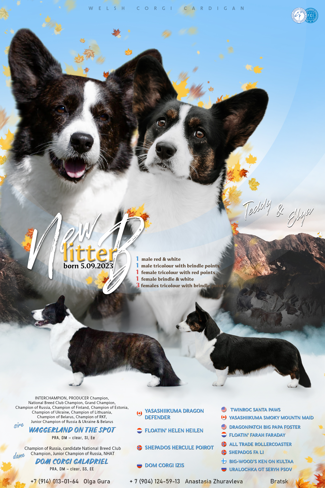

# dogs_segmentation

# Dog Extractor: Автоматизация создания презентаций о породистых собаках

Проект создан для автоматизации процесса подготовки изображений породистых собак для использования в презентациях. Основная задача — "вырезать" собаку с фотографии пользователя, сохранив её на прозрачном фоне, чтобы дальнейшая обработка могла быть выполнена в сервисе по созданию презентаций.

## Пример работы
<div style="display: flex; justify-content: center; gap: 20px;">
  <div style="text-align: center;">
    <p>Фотография собаки, предоставленная пользователем</p>
    
    
  </div>
  <div style="text-align: center;">
    <p>Итог работы полного продукта</p>
    
    
  </div>
</div>


## Описание процесса
Для решения задачи используется сегментация изображений. Это позволяет точно отделить собаку от фона и преобразовать фон в прозрачный.

### Ключевые особенности:
- Используется модель **YOLO11**, которая является SOTA (State Of The Art) моделью на момент её релиза.
- Высокая точность распознавания объектов, что гарантирует качественное отделение собак от фона.
- Простота интеграции в сервисы для дальнейшей обработки.

## Как запустить проект
1. Установите все зависимости:
    ```bash
    pip install -r requirements.txt
    ```
2. Запустите обработку изображения:
    ```bash
    python main.py --input <path_to_image> --output <path_to_output>
    ```
3. Результат будет сохранён в указанной директории.

## Пример использования
1. Загрузите фотографию собаки.
2. Запустите скрипт, чтобы обработать изображение.
3. Получите PNG-файл с прозрачным фоном, готовый для добавления в презентацию.

## Используемые технологии
- **YOLO11** — модель для сегментации.
- **Python** — основной язык разработки.
- **OpenCV** — для обработки изображений.

## Контакты
Если у вас есть вопросы или предложения, свяжитесь со мной по email: example@example.com.
